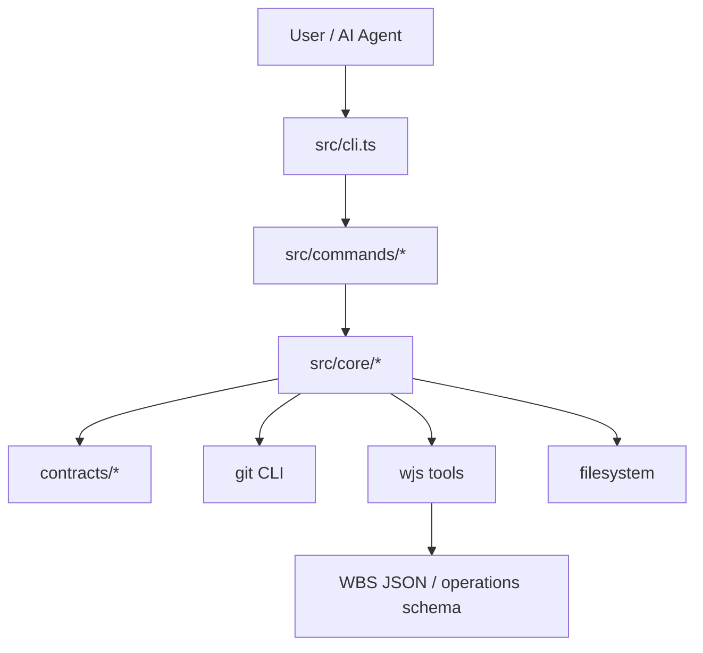

# scwbs アーキテクチャ監査レポート

作成日: 2026-06-29

この文書は、GPT5.4-mini による初回調査結果を、現行リポジトリの実装とドキュメントに照らして再検証した監査結果である。コードの修正ではなく、確認済みの事実、訂正点、残るリスク、改善順序を整理する。

## 1. 監査サマリー

`scwbs` は、SC-WBS Development をこのリポジトリ自身に適用するための TypeScript CLI である。`contracts/wbs/project.wbs.json` を WBS の正本とし、`contracts/tasks/*.yaml`、`contracts/evidence/*.yaml`、`contracts/approvals/*.yaml`、`contracts/registry.yaml` を使って、AI 実装の範囲、証跡、Human Gate、レビュー準備状態をファイルベースで管理する。

全体として、アーキテクチャは小規模 CLI として妥当である。`src/cli.ts` はコマンドの入口、`src/commands/` はユースケース、`src/core/` は契約・WBS・Git・YAML・パス・レポートの共通処理を担当している。現時点で DB、Web UI、外部サービス常時接続を前提にしていない点は、SC-WBS の目的に合っている。

ただし、初回調査には実装と異なる指摘が含まれていた。`src/commands/ai-packet.ts` の Stop Conditions は現行ソースでは文字化けしておらず、README のディレクトリツリーも崩れていない。一方で、Git 差分の基準、Evidence の provenance、`health` の保証範囲、簡易 YAML パーサのサポート範囲は、今後の運用リスクとして残っている。

## 2. 主要構成



主な責務は次のとおりである。

| 領域 | 現在の役割 |
|---|---|
| `src/cli.ts` | サブコマンドの解析とコマンド関数への委譲 |
| `src/commands/` | `check`、`check-diff`、`health`、`ai packet`、`evidence collect` などのユースケース |
| `src/core/contracts.ts` | Task、Evidence、Spec、Approval、Registry の読み込み |
| `src/core/schema.ts` | 読み込んだ契約ファイルのランタイム検証 |
| `src/core/wbs.ts` | WBS 読み込み、WJS validation、WBS node 検証 |
| `src/core/git.ts` | 現在ブランチ、HEAD commit、変更ファイル、commit 存在確認 |
| `src/core/yaml.ts` | この CLI が扱う契約 YAML の簡易読み書き |
| `contracts/` | WBS、Task Contract、Evidence、Approval、Registry、Changeset |
| `docs/scwbs/` | 分割された運用・CLI ドキュメント |
| `wjs/` | WBS-JSON の canonical 実装 |

## 3. 確認できた強み

### 契約境界が実装に組み込まれている

Task Contract の `allowedPaths`、`forbiddenPaths`、`humanGateRequiredPaths` を `check-diff` が実際に検査している。これは単なる運用ルールではなく、AI が契約外の変更を進めにくくする実行時ガードになっている。

### WBS の直接編集に対するガードがある

`contracts/wbs/project.wbs.json` が変更されている場合、`contracts/changesets/*.json` が存在しないと `check` / `check-diff` がエラーにする。さらに changeset は `wjs/tools/validate.ts --operations` で検証される。WBS 正本をツール経由で扱う方向性は妥当である。

### コマンド単位の見通しがよい

`src/commands/` はユースケース単位に分かれており、初見でも対象機能を探しやすい。`tests/scwbs.test.ts` も一時リポジトリを作る統合寄りのテストになっているため、契約ファイル、Git、CLI の組み合わせを検証しやすい。

### AI 向け文脈が分割されている

`docs/scwbs/` に運用ドキュメントが分割され、`ai packet` も対象 Task Contract と近傍 WBS context に絞る設計になっている。大きな方法論文書だけに依存しない点は、AI 作業のコストと誤読を下げる。

## 4. 初回調査からの訂正

### 訂正: AI Work Packet の Stop Conditions は文字化けしていない

初回調査では `src/commands/ai-packet.ts` の Stop Conditions が文字化けしているとされていたが、現行ソースでは次の内容が可読な日本語で出力される。

- DB スキーマ変更が必要
- 認証・権限変更が必要
- API 契約の破壊的変更が必要
- Business Rule が不足している
- `allowedPaths` 外の変更が必要
- 仕様変更レベル判断に迷う場合は Level 2 として扱う
- Human Gate 対象変更は Level 0 または Level 1 に見えても停止する

したがって、この点を High リスクとして扱う必要はない。改善するなら、文字化け修正ではなく、`docs/scwbs/ai-work-packet.md` 側にも実装と同じ最後の 2 条件を追記して同期するのが適切である。

### 訂正: README のツリー表記は崩れていない

初回調査では README のディレクトリ図が文字化けしているとされていたが、現行 `README.md` は UTF-8 で正しく読める。入口ドキュメントとして致命的な可読性問題は確認できない。

### 補足: `health` の文書は実装より強く読める

`docs/scwbs/contract-enforcement.md` は、テスト差分に対して assertion、skip 化、coverage 低下を検出するように読める。一方、現行 `src/commands/health.ts` はソース差分や coverage report を直接解析していない。Evidence の `testQuality` メタデータが欠けている、または `assertionsAdded: false`、`testsDisabled: true`、`coverageDecreased: true` と記録されている場合に警告する実装である。

このため、`health` は「証跡メタデータに基づく運用健全性チェック」と説明するのが正確である。

## 5. 優先リスク

### R1: 差分基準が作業ツリー中心で、PR 全体差分とずれる

重要度: High

`src/core/git.ts` の `changedFiles()` は、`git diff --name-only HEAD` と `git ls-files --others --exclude-standard` を合わせて返す。つまり、対象は現在の未コミット変更と未追跡ファイルであり、`origin/main...HEAD` のようなブランチ全体差分ではない。

この関数は少なくとも次で使われている。

- `src/commands/check.ts`
- `src/commands/check-diff.ts`
- `src/commands/evidence-collect.ts`

現状の挙動は、ローカル作業中の契約外変更を検出するには有効である。一方で、Evidence の `changedFiles` や PR readiness を判断する基準としては、コミット済みのブランチ差分を取り逃がす可能性がある。たとえば、変更をすべてコミットした後に未コミット差分がない状態では、`check-diff` の path 検査対象が空になる。

改善案:

- `changedFiles()` の現在の意味を `workingTreeChangedFiles()` のように明確化する。
- PR readiness 用に `git diff --name-only <base>...HEAD` 相当の関数を追加する。
- Evidence に `baseRef`、`baseCommit`、`headCommit`、`changedFilesBasis` のような provenance を残す。
- `check-diff` が作業ツリー差分とブランチ差分のどちらを見るのか、コマンド名またはオプションで明示する。

### R2: Evidence provenance はまだ再現性が弱い

重要度: High

`evidence collect` は `commit`、`git.branch`、`git.headCommit`、`changedFiles`、required checks の実行結果を記録する。しかし、`changedFiles` は上記のとおり作業ツリー基準であり、どの base との差分なのかを Evidence 自体から再現できない。

Evidence を human review や PR readiness の根拠にするなら、最低限、差分基準と head の整合性を強める必要がある。

改善案:

- Evidence に差分基準を明記する。
- `health` で Evidence の `headCommit` と現在 HEAD、または PR head との不一致を警告する。
- GitHub PR metadata を使う場合、Evidence または Approval に PR 番号、head SHA、base SHA を残す。

### R3: `health` は強い静的解析ではなくメタデータ検査である

重要度: Medium

現行 `health` は、Evidence の信頼度、commit 存在、branch / head / PR metadata、`changedFiles` と Task Contract の path 制約、Human Gate approval、registry status、Task Contract lock、Evidence の `testQuality` メタデータを検査する。

一方で、テストファイルの AST を読んで assertion 数を比較したり、coverage report を解析したり、skip 化を diff から自動判定したりはしていない。`docs/implementation-gaps.md` も、この領域を未実装として扱っている。

改善案:

- `docs/scwbs/contract-enforcement.md` の説明を「Evidence の `testQuality` メタデータに基づく警告」と明確化する。
- 実装を強化する場合は、まず coverage report 比較のような低コストな入力から始める。
- AST ベースの assertion カウントは、対応言語とテストフレームワークを絞って導入する。

### R4: YAML パーサは意図的なサブセット実装である

重要度: Medium

`src/core/yaml.ts` は外部 YAML ライブラリを使わず、単純な key-value、配列、配列内オブジェクト、1 階層程度の nested map / nested array を扱う自前実装である。依存を小さく保つ方針には合っているが、一般的な YAML としては表現力が限定される。

想定外の YAML 構文を契約ファイルに入れると、静かに別の値として読まれる、または stringify で構造が落ちるリスクがある。

改善案:

- サポートする YAML サブセットをドキュメント化する。
- Task / Evidence / Approval / Registry の代表例で round-trip テストを増やす。
- 複雑な YAML が必要になった時点で、依存追加のコストと自前実装維持コストを比較する。

### R5: `src/core/` が成長しやすい

重要度: Low

現時点では `src/core/` の規模は許容範囲である。ただし、契約モデル、ランタイム検証、WBS 操作、Git、YAML、パス、レポートが同じ階層に置かれているため、機能追加が続くと見通しが落ちやすい。

今すぐ大きな再編は不要である。新しい機能を追加する時にだけ、責務の境界を少しずつ分けるのがよい。

候補:

```text
src/core/
  contracts/
  validation/
  git/
  yaml/
  report/
```

## 6. ドキュメント整合性

現行ドキュメントの大枠は実装と整合している。特に `docs/sc-wbs-development.md` と `docs/scwbs/` の分割は、AI が必要範囲だけ読む運用に向いている。

修正候補は次のとおりである。

| 優先度 | 対象 | 修正内容 |
|---|---|---|
| High | `docs/scwbs/contract-enforcement.md` | `health` が AST / coverage を直接解析するように読める表現を、Evidence `testQuality` メタデータ中心の説明へ修正する |
| Medium | `docs/scwbs/ai-work-packet.md` | 実装にある Stop Conditions のうち、Level 2 判断と Human Gate 停止条件を追記する |
| Medium | `docs/scwbs/evidence-human-gate-review.md` | Evidence の `changedFiles` が現状どの差分基準から生成されるかを明記する |
| Low | `docs/implementation-gaps.md` | Evidence provenance と branch diff 基準の強化を未実装項目として明記する |

## 7. 改善ロードマップ

### Phase 1: 低コストな文書修正

- `health` の保証範囲を文書上で現実に合わせる。
- AI Work Packet の Stop Conditions を実装とドキュメントで同期する。
- Evidence の `changedFiles` が現状 working tree 基準であることを明記する。
- `docs/implementation-gaps.md` に branch diff / provenance 強化を追加する。

### Phase 2: 差分と Evidence の意味を分離する

- 作業ツリー差分とブランチ差分の関数を分ける。
- `check-diff` の目的を、ローカル作業チェックと PR readiness チェックのどちらに寄せるか決める。
- Evidence に base / head / basis metadata を追加する。
- `health` で Evidence head と現在の branch / PR head のずれを検出する。

### Phase 3: 健全性検査を段階的に強化する

- Evidence `testQuality` の入力仕様を固める。
- coverage report がある場合だけ比較する低コスト検査を追加する。
- 必要になった時点で AST ベースの assertion / skip 検査を検討する。
- YAML サブセットの round-trip テストを拡充する。

## 8. 総合評価

| 項目 | 評価 |
|---|---|
| アーキテクチャ | 7 / 10 |
| ディレクトリ構成 | 8 / 10 |
| 契約境界の強制 | 8 / 10 |
| Evidence 再現性 | 5 / 10 |
| テスト容易性 | 8 / 10 |
| ドキュメント整備 | 7 / 10 |
| AI 開発適性 | 8 / 10 |
| 保守性 | 7 / 10 |

総評として、`scwbs` は小規模 CLI として筋がよく、契約駆動の AI 実装を支えるガードも実装に入っている。特に Task Contract、WBS changeset gate、Human Gate path、review metadata の方向性は有効である。

最優先で直すべき設計上の曖昧さは、差分の基準である。現在の `changedFiles()` は作業ツリー検出としては有用だが、Evidence や PR readiness の根拠としては基準が弱い。次点で、`health` の保証範囲を文書と実装で揃え、Evidence provenance を強めるとよい。

